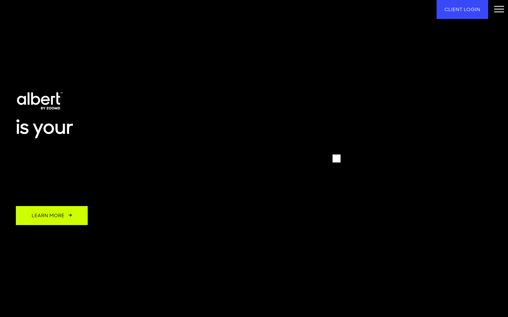

# albert DESIGN.md

> Auto-generated design system — reverse-engineered via static analysis by skillui.
> Frameworks: None detected
> Colors: 20 · Fonts: 3 · Components: 9
> Icon library: not detected · State: not detected
> Primary theme: light · Dark mode toggle: no · Motion: expressive

## Visual Reference

**Match this design exactly** — study colors, fonts, spacing, and component shapes before writing any UI code.



---

## 1. Visual Theme & Atmosphere

This is a **light-themed** interface with a warm, approachable feel. The light background emphasizes content clarity. Typography pairs **SharpSansDispNo1-Medium** for display/headings with **SharpSansDisplayNo1** for body text, creating clear visual hierarchy through type contrast. Spacing follows a **4px base grid** (compact density), with scale: 2, 4, 6, 8, 10, 12, 14, 16px. The palette is predominantly monochromatic with **#ceff00** as the single accent color — used sparingly for interactive elements and emphasis. Motion is expressive — spring physics, layout animations, and staggered reveals are part of the visual language.

---

## 2. Color Palette & Roles

| Token | Hex | Role | Use |
|---|---|---|---|
| wp--preset--color--white | `#ffffff` | background | Page background, darkest surface |
| wp--preset--color--black | `#000000` | text-primary | Headings and body text |
| text-muted | `#98a2b3` | text-muted | Captions, placeholders, secondary info |
| border | `#40464d` | border | Dividers, card borders, outlines |
| accent | `#ceff00` | accent | CTAs, links, focus rings, active states |
| info | `#394cff` | info | Informational highlights |
| unknown | `#dddddd` | unknown | Palette color |
| unknown | `#f0f0f0` | unknown | Palette color |
| unknown | `#0783be` | unknown | Palette color |
| unknown | `#001b56` | unknown | Palette color |
| unknown | `#00b4ff` | unknown | Palette color |
| unknown | `#667085` | unknown | Palette color |
| unknown | `#969696` | unknown | Palette color |
| unknown | `#1e1f26` | unknown | Palette color |
| unknown | `#cccccc` | unknown | Palette color |
| unknown | `#d0d5dd` | unknown | Palette color |
| unknown | `#313131` | unknown | Palette color |
| unknown | `#0071a1` | unknown | Palette color |
| unknown | `#344054` | unknown | Palette color |
| unknown | `#bbbbbb` | unknown | Palette color |


---

## 3. Typography Rules

**Font Stack:**
- **SharpSansDisplayNo1** — Heading 1, Heading 2, Heading 3
- **SharpSansDispNo1-Medium** — Body, Caption
- **Courier 10 Pitch** — Code

**Font Sources:**

```css
@font-face {
  font-family: "SharpSansDisplayNo1-Semibold";
  src: url("fonts/SharpSansDisplayNo1-Semibold-Regular.woff") format("woff");
  font-weight: 400;
}
@font-face {
  font-family: "SharpSansDisplayNo1-Bold";
  src: url("fonts/SharpSansDisplayNo1-Bold-Regular.otf") format("opentype");
  font-weight: 400;
}
@font-face {
  font-family: "SharpSansDisplayNo1-Medium";
  src: url("fonts/SharpSansDisplayNo1-Medium-Regular.otf") format("opentype");
  font-weight: 400;
}
@font-face {
  font-family: "SharpSansDisplayNo1-Thin";
  src: url("fonts/SharpSansDisplayNo1-Thin-Regular.woff2") format("woff2");
  font-weight: 400;
}
@font-face {
  font-family: "SharpSansDisplayNo1-Book";
  src: url("fonts/SharpSansDisplayNo1-Book-Regular.woff2") format("woff2");
  font-weight: 400;
}
@font-face {
  font-family: "SharpSansDisplayNo1-Light";
  src: url("fonts/SharpSansDisplayNo1-Light-Regular.woff2") format("woff2");
  font-weight: 400;
}
@font-face {
  font-family: "SharpSansDispNo1-Medium";
  src: url("fonts/SharpSansDispNo1-Medium-Regular.woff") format("woff");
  font-weight: 400;
}
@font-face {
  font-family: "SharpSansDispNo1-Semibold";
  src: url("fonts/SharpSansDispNo1-Semibold-Regular.woff") format("woff");
  font-weight: 400;
}
@font-face {
  font-family: "SharpSansDispNo1-Bold";
  src: url("fonts/SharpSansDispNo1-Bold-Regular.woff") format("woff");
  font-weight: 400;
}
@font-face {
  font-family: "SharpSansDispNo1";
  src: url("fonts/SharpSansDispNo1-Regular.woff") format("woff");
  font-weight: 400;
}
@font-face {
  font-family: "dashicons";
  src: url("https://albert.ai/wp-includes/fonts/dashicons.eot?99ac726223c749443b642ce33df8b800");
  font-weight: 400;
}
```

| Role | Font | Size | Weight |
|---|---|---|---|
| Heading 1 | SharpSansDisplayNo1 | 4.8rem | 700 |
| Heading 2 | SharpSansDisplayNo1 | 50px | 700 |
| Heading 3 | SharpSansDisplayNo1 | 48px | 700 |
| Body | SharpSansDispNo1-Medium | 18px | 400 |
| Caption | SharpSansDispNo1-Medium | 12px | 400 |
| Code | Courier 10 Pitch | 14px | 400 |

**Typographic Rules:**
- Limit to 3 font families max per screen
- Use **SharpSansDisplayNo1** for body/UI text, **SharpSansDispNo1-Medium** for display/headings
- Maintain consistent hierarchy: no more than 3-4 font sizes per screen
- Headings use bold (600-700), body uses regular (400)
- Line height: 1.5 for body text, 1.2 for headings
- Use color and opacity for secondary hierarchy, not additional font sizes


---

## 4. Component Stylings

### Layout (1)

**Footer** — `html`

### Navigation (1)

**Navigation** — `html`

### Data Display (2)

**Badge** — `html`

**List** — `html`

### Data Input (2)

**Button** — `html`
- Animation: 

**Input** — `html`
- State: :focus, :placeholder

### Media (3)

**Image** — `html`

**Icon** — `html`

**Map/Canvas** — `html`


---

## 5. Layout Principles

- **Base spacing unit:** 4px
- **Spacing scale:** 2, 4, 6, 8, 10, 12, 14, 16, 18, 20, 22, 24
- **Border radius:** 1.5em, 2em, 2px, 8px, inherit, 1px, 3px, 4px, 5px, 6px, 10px, 12px, 15px, 40px, 100%, 100px, 120px
- **Max content width:** 1080px

**Spacing as Meaning:**
| Spacing | Use |
|---|---|
| 4-8px | Tight: related items within a group |
| 12-16px | Medium: between groups |
| 24-32px | Wide: between sections |
| 48px+ | Vast: major section breaks |


---

## 6. Depth & Elevation

### Flat — subtle depth hints

- `0 0 2px 2px rgba(0,0,0,0.6)`
- `0 0 0 1px #4f94d4,0 0 2px 1px rgba(79,148,212,.8)`
- `2px -2px 0px 0px currentColor`

### Raised — cards, buttons, interactive elements

- `0 3px 3px rgba(0,0,0,0.2)`
- `0px 0px 0px 3px #ebf5fa,0px 0px 0px rgba(255,54,54,.25)`
- `0px 1px 3px rgba(16,24,40,.1),0px 1px 2px rgba(16,24,40,.06)`

### Floating — dropdowns, popovers, modals

- `0px 12px 16px -4px rgba(16,24,40,.08),0px 4px 6px -2px rgba(16,24,40,.03)`
- `0 5px 15px rgba(0,0,0,.7)`
- `0 0 4px rgba(0,0,0,.04),0 8px 16px rgba(0,0,0,.08),inset 0 0 0 1px hsla(0,0%,100%,.08)`

### Overlay — full-screen overlays, top-level dialogs

- `0 5px 30px -5px rgba(0,0,0,.25)`
- `0px 8px 24px 4px rgba(16,24,40,.12)`
- `0px 0px 0px 3px #ebf5fa,0px 8px 24px 4px rgba(16,24,40,.12)`

### Z-Index Scale

`0, 1, 2, 4, 9, 99, 100, 700, 800, 801, 850, 998, 999, 1001, 1002, 1020, 1050, 1051, 9999, 59899, 99999, 100000, 159900, 160000, 900000, 900001, 900002, 999999, 2000000, 3000000, 5000000, 999999999, 9999999999`


---

## 7. Animation & Motion

This project uses **expressive motion**. Animations are an integral part of the experience.

### CSS Animations

- `@keyframes show-content-image`
- `@keyframes turn-on-visibility`
- `@keyframes turn-off-visibility`
- `@keyframes lightbox-zoom-in`
- `@keyframes lightbox-zoom-out`
- `@keyframes overlay-menu__fade-in-animation`
- `@keyframes spin`
- `@keyframes blink`

### Animated Components

- **Button**: 

### Motion Guidelines

- Duration: 150-300ms for micro-interactions, 300-500ms for page transitions
- Easing: `ease-out` for enters, `ease-in` for exits
- Always respect `prefers-reduced-motion`


---

## 8. Do's and Don'ts

### Do's

- Use `#ceff00` for interactive elements (buttons, links, focus rings)
- Use `#ffffff` as the primary page background
- Pair **SharpSansDisplayNo1** (body) with **SharpSansDispNo1-Medium** (display) — these are the only allowed fonts
- Follow the **4px** spacing grid for all margins, padding, and gaps
- Use the defined shadow tokens for elevation — see Section 6
- Use border-radius from the scale: 1.5em, 2em, 2px, 8px, inherit
- Reuse existing components from Section 4 before creating new ones

### Don'ts

- Don't introduce colors outside this palette — extend the design tokens first
- Don't introduce additional font families beyond SharpSansDisplayNo1 and SharpSansDispNo1-Medium and Courier 10 Pitch
- Don't use arbitrary spacing values — stick to multiples of 4px
- Don't create custom box-shadow values outside the system tokens
- Don't use arbitrary border-radius values — pick from the defined scale
- Don't duplicate component patterns — check Section 4 first
- Don't use backdrop-blur or blur effects

### Anti-Patterns (detected from codebase)

- No blur or backdrop-blur effects
- No zebra striping on tables/lists


---

## 9. Responsive Behavior

| Name | Value | Source |
|---|---|---|
| xs | 480px | css |
| sm | 600px | css |
| sm | 640px | css |
| md | 767px | css |
| md | 768px | css |
| lg | 781px | css |
| lg | 782px | css |
| lg | 850px | css |
| lg | 880px | css |
| lg | 900px | css |
| lg | 1000px | css |
| lg | 1024px | css |
| xl | 1025px | css |
| xl | 1080px | css |
| xl | 1200px | css |
| xl | 1250px | css |
| 2xl | 1399px | css |
| 2xl | 1400px | css |
| 2xl | 1600px | css |

**Approach:** Use `@media (min-width: ...)` queries matching the breakpoints above.


---

## 10. Agent Prompt Guide

Use these as starting points when building new UI:

### Build a Card

```
Background: #ffffff
Border: 1px solid #40464d
Radius: 5px
Padding: 16px
Font: SharpSansDisplayNo1
Use shadow tokens from Section 6.
```

### Build a Button

```
Primary: bg #ceff00, text white
Ghost: bg transparent, border #40464d
Padding: 8px 16px
Radius: 5px
Hover: opacity 0.9 or lighter shade
Focus: ring with #ceff00
```

### Build a Page Layout

```
Background: #ffffff
Max-width: 1080px, centered
Grid: 4px base
Responsive: mobile-first, breakpoints from Section 9
```

### Build a Stats Card

```
Surface: #ffffff
Label: #98a2b3 (muted, 12px, uppercase)
Value: #000000 (primary, 24-32px, bold)
Status: use success/warning/danger from Section 2
```

### Build a Form

```
Input bg: #ffffff
Input border: 1px solid #40464d
Focus: border-color #ceff00
Label: #98a2b3 12px
Spacing: 16px between fields
Radius: 5px
```

### General Component

```
1. Read DESIGN.md Sections 2-6 for tokens
2. Colors: only from palette
3. Font: SharpSansDisplayNo1, type scale from Section 3
4. Spacing: 4px grid
5. Components: match patterns from Section 4
6. Elevation: shadow tokens
```
